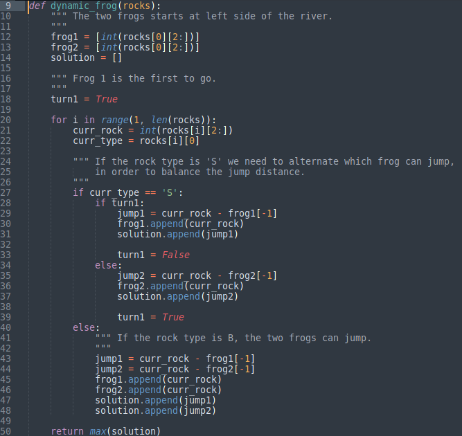

# Dynamic Frog #1054

Análise do algorítmo 'Sapo Dinâmico #1054' do [Beecrowd](https://www.beecrowd.com.br/judge/pt/problems/view/1054)

## Algorítmo

## Análise

A função *dynamic_frog()* é executado *n* vezes, onde *n* é a quantidade de casos de teste.

Para cada caso de teste, ten-se uma lista com *r* pedras, onde *r* é a quantidade de pedras de um caso *n*. A lista é organizada de forma que a primeira posição contém uma pedra grande com distância *0* e a última posição possui uma pedra grande de distância *maxD*, onde *maxD* é a distância total da margem direita até a margem esquerda do rio. Observe o exemplo de um caso qualquer a seguir:

- [*B-0*, S-2, B-14, S-20, S-26, B-38, S-43, *B-maxD*]

A função *dynamic_frog()* recebe como entrada essa lista *r* de pedras. Dentro da função é criado dois sapos que irão alternar os pulos nas pedras pequenas, para que possa ser balanceado a distância máxima dos pulos. A lista é percorrida uma única vez, da posição 1 até a última posição da lista. Em cada iteração é verificado o tipo de pedra:

- *B*: os dois sapos podem pular na pedra, já que a mesma não afunda.
- *S*: alterna-se o pulo dos sapos, sendo que o primeiro sapo é o primeiro a pular quando é econtrada a primeira pedra pequena.

Após cada salto, é armazenado na lista soluções todas as distâncias dos pulos feitas por cada sapo. Ao concluir a execução do loop é retornado a distância máxima armazenada na lista de soluções. Onde essa distância é o maior pulo que o sapo terá que dar para atravessar o rio tanto na ida quanto na volta.

## Big-O

Para cada caso de teste é executado um loop de 1 à *l*, onde *l* é o tamanho da lista *r* de pedras. Todos os outros cálculos sobre os pulos são de custo 1, logo temos que o algorítmo é executado com *O(n)*.

## Paradigma

O paradigma usado para resolver o problema foi o paradigma guloso, pois os sapos irão sempre pular na pedra mais próxima, alternando seus pulos nas pedras pequenas e sempre pulando nas pedras grande. 